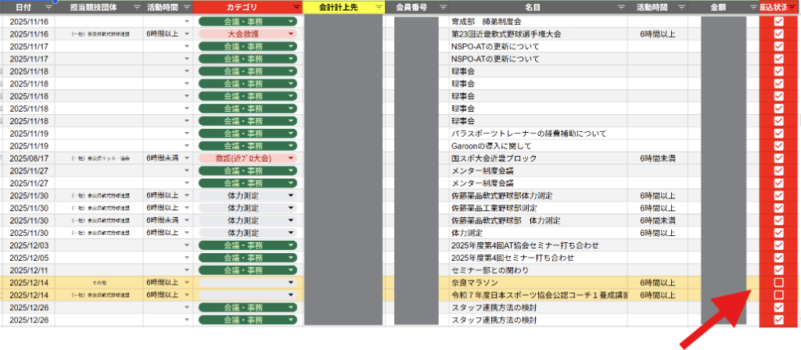
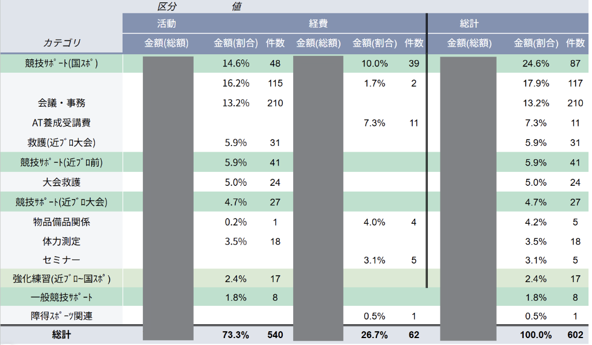
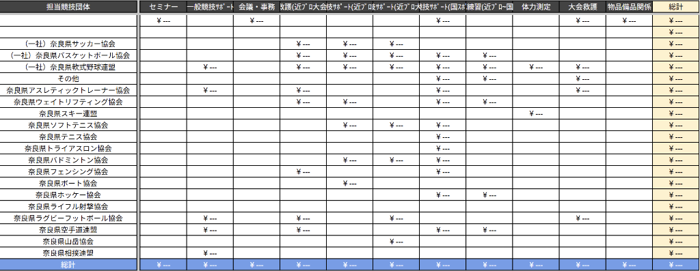

<!-- noteURL: [ここにURLを貼る] -->
<!-- サムネイル用メモ
一言: バラバラの管理から卒業！
タイトル: 【会計部門編】AT協会の会計処理をラクにした一元化と自動化の仕組み
-->

こんにちは。奈良AT協会です！

[前回の記事（運営効率化の道のり）](./AT協会運営効率化の道のり.md)でお話しした通り、今回は「バラバラになって破綻しかけていた会計システムをどうやって改善したか」について詳しくお話ししますね。

## 課題から解決策へ：全部を「一つの場所」へ

スタッフが増え、派遣先が増えたことで、「誰が・いつ・どこで・いくらやりとりしたのか」が把握できなくなっていた問題。

まずは全貌を把握した後、あちこちにあったExcelや紙の記録を、**すべてGoogleスプレッドシート（オンラインで共有できるExcelのようなもの）の「1つの場所」にまとめました。**

### メリット1：「あのファイル、どこだっけ？」の解消
情報が一つの場所に集まったことで、「ここまで処理したっけ？」「請求書のファイルどこにやったっけ？」というような迷子現象がきれいになくなりました。

### メリット2：自動チェックと「メール送信」
スプレッドシート上で確認作業を行えるようにし、チェックを入れると**対象のスタッフに「振込確認メール」が自動で送信される仕組み**を追加しました。
複数の画面やアプリを行き来することなく、概ね一つのファイル上で作業が完結するようになっています。

### メリット3：集計が圧倒的にラクに
データが完全に1つの形式・1つの場所に集まっているため、それらを「年間集計」「競技団体別」「スタッフ別」といったカテゴリごとに分類するのが非常に簡単になりました。
手間暇かかっていた年間集計も、ボタンひとつで確認できる状態になっています！

一つ一つは小さな改善ですが、これが積み上がると事務局の作業時間は劇的に短縮されます。

## 具体的な会計シートの構成と仕組み

「自動化」と聞くと難しそうに感じますが、私自身、最初から高度な仕組みが作れたわけではありません。AIに手伝ってもらうことで、コード（プログラムや数式）の中身までは完璧に分からなくても、このようなシステムを作ることができました！

現在の会計システムは、大きく分けて以下の6つの要素・シートで構成されています。

### 1. スタッフ名簿（情報を安全に同期する）
入会登録時のGoogleフォームから、別のスタッフが管理している「スタッフ名簿」を作成しています。
会計シート側では、その名簿のデータを**`IMPORTRANGE`**という関数を使って呼び出し（同期させ）ています。

> **💡 ポイント**：この関数は一方通行でデータを引っ張ってくるだけなので、会計担当のスタッフが誤って名簿の大元データを削除・編集してしまう心配がなく、安全にほぼリアルタイムな情報だけを扱えます。

### 2. 活動記録（原文を残しつつ転記）
現場での活動ごとに、スタッフがフォームから実施内容を投稿してくれます。
投稿された原文はそのまま保持しつつ、それを自動で「会計まとめ」のシートへ転記するようにしています。

この自動転記を担っているのが**GAS（Google Apps Script）**というプログラムです。後から万が一こちらで金額の誤りなどを修正することがあっても、スタッフが最初に投稿した元のデータはしっかり残るように工夫しています。

### 3. 会議まとめ
当会では会議費が支給されますが、会議ごとに参加スタッフ全員が個別で入力するのは大変ですし、入力漏れが起きる原因になります。
そこで、会議の主催者が一度にまとめて「誰が参加したか」を入力すれば完了する仕組みにしました。

### 4. 会計まとめ（SPILL機能と自動エラーチェック）
上で集まった「活動記録」や「会議まとめ」のデータを一覧表示し、スタッフ名簿からのデータと紐づけて、会員番号や銀行口座情報を自動で表示させます。

> **💡 ポイント**：ここで活躍するのが**スピル（SPILL）**というスプレッドシートの機能です。セル一つ一つに数式を入れるのではなく、一つ数式を書けば表全体にバシッと反映されます。「行を削除したら数式が消えて壊れちゃった…」というような“Excelあるある”を防ぐことができます！

会計スタッフがこの画面を目視で確認し、問題がなければ「入金済み」のチェックボックスを付けます。
またこの時、特定の処理に対して同じスタッフから同じ日の申請が重複していないかなどを数式で自動チェックし、エラーを教えてくれる機能も入れているので安心です。

### 5. 自動メール送信（再びGASの活用）
「会計まとめ」でチェックを付けた瞬間、またしても**GAS**が働きます！
チェックが入った行のデータ（相手の氏名、件名、金額など）を基本のメールテンプレートに自動で差し込み、スタッフ名簿から紐づけたアドレス宛にメールを自動送信してくれます。

### 6. 年間まとめ（ピボットテーブルの活用）
最後に、処理が終わった項目を集計します。ここはExcelでもおなじみの**ピボットテーブル**という機能を使っています。
会計まとめの情報をさっと拾い上げ、スタッフごとの一覧や、競技団体ごとの一覧など、年間の集計を一目で確認できるようにしています。

---

## さらに詳しい裏話（技術的な詳細）

「具体的にどうやってスプレッドシートを作っているの？」「自動でメールを送るってどんなプログラム？」と気になった方向けに、さらに深掘りした記事も用意していく予定です。
（※こちらは随時追記していきますね！）

> 🔗 **現場が入力しやすい工夫について**：[会計詳細_スプレッドシート編（AppSheetなどの活用）](./AT協会運営効率化_会計詳細_スプレッドシート編.md)
> 🔗 **自動メール送信などの裏側について**：[会計詳細_GAS編（プログラミングによる自動化）](./AT協会運営効率化_会計詳細_GAS編.md)
